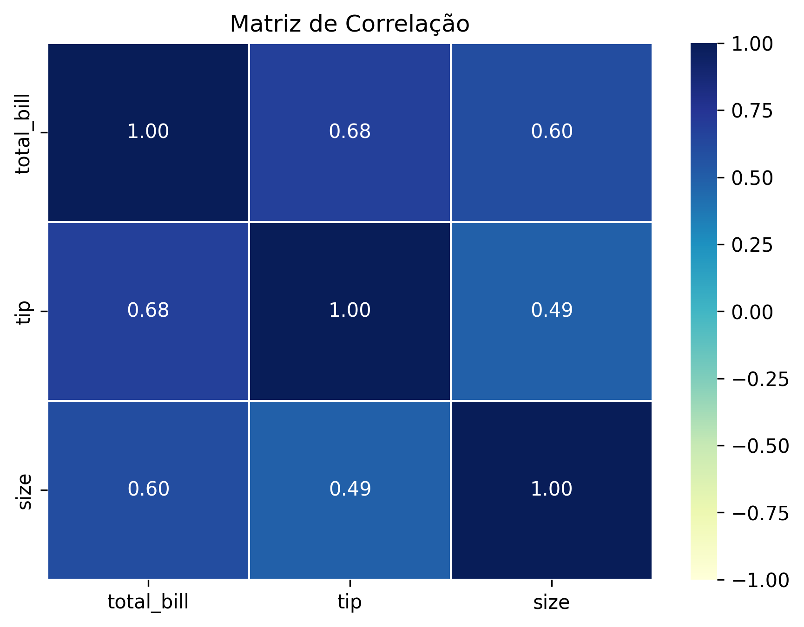
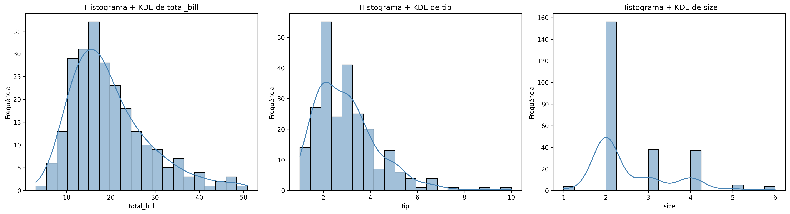
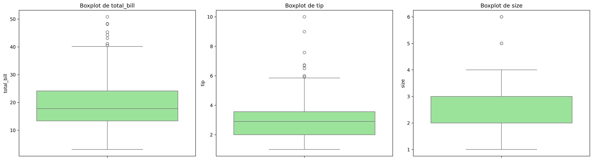

# 📊 Estatística Descritiva e Exploratória — Atividade Prática

Este repositório contém a atividade prática de **Estatística Descritiva e Exploratória (EDA)**, desenvolvida na disciplina de **Análise e Exploração de Dados (AED)**, utilizando o dataset **"Tips"** da biblioteca *seaborn*.

---

### 👥 Integrantes do Grupo

* Maria Luiza Vieira Belo
* Lucca Spinelli
* Marcello Augusto
* Eliziane Mota
* Jardel Simplício

**Turma:** ADS Regular — 3º Período

---

### Sobre a Atividade

O notebook apresenta, de forma progressiva e interpretativa:

* Carregamento e inspeção do dataset
* Medidas de tendência central e dispersão
* Identificação e análise de outliers
* Avaliação de assimetria e curtose
* Análise de correlação entre variáveis numéricas
* Visualizações (histogramas, KDE e boxplots)
* Normalização dos dados (Min-Max e Z-score)
* Interpretações em linguagem acessível ao longo da análise

---

### Como executar o projeto

#### 1. Instalar dependências

Recomenda-se o uso de ambiente virtual (foi utilizado **UV** para gerenciamento de pacotes):

```bash
uv add pandas seaborn matplotlib scikit-learn scipy ipykernel
```

---

#### 2. Abrir o notebook

```bash
jupyter notebook Atividade_estatística_descritiva.ipynb
```

---

#### 3. Executar

Execute as células em ordem para acompanhar toda a análise e interpretações.

---

### Visualizações - Principais gráficos gerados durante a análise exploratória dos dados:

<h3 align="center">Matriz de Correlação</h3>
<p align="center">
  
</p>

<h3 align="center">Histograma</h3>
<p align="center">
  
</p>

<h3 align="center">Boxplot</h3>
<p align="center">
  
</p>